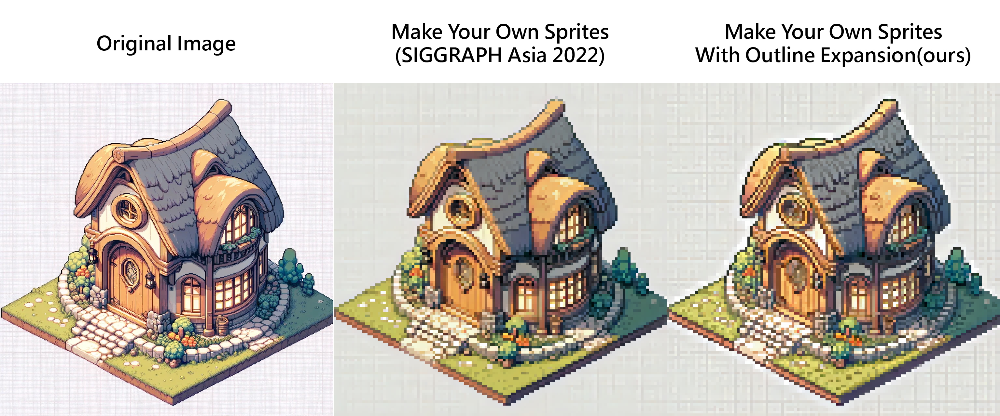
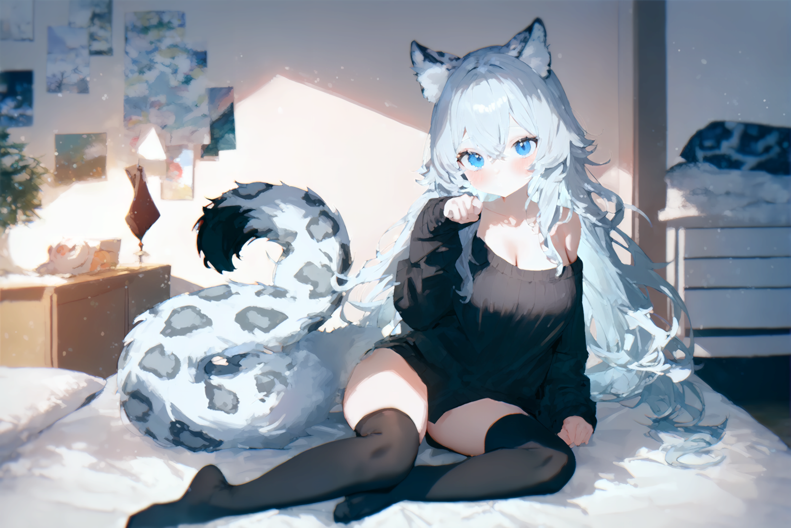
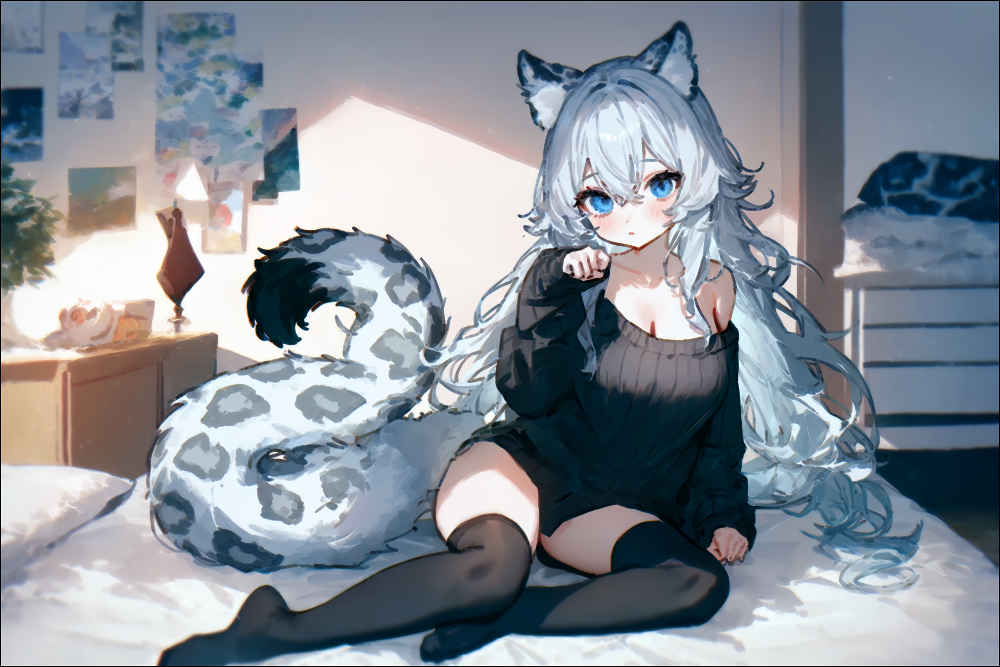
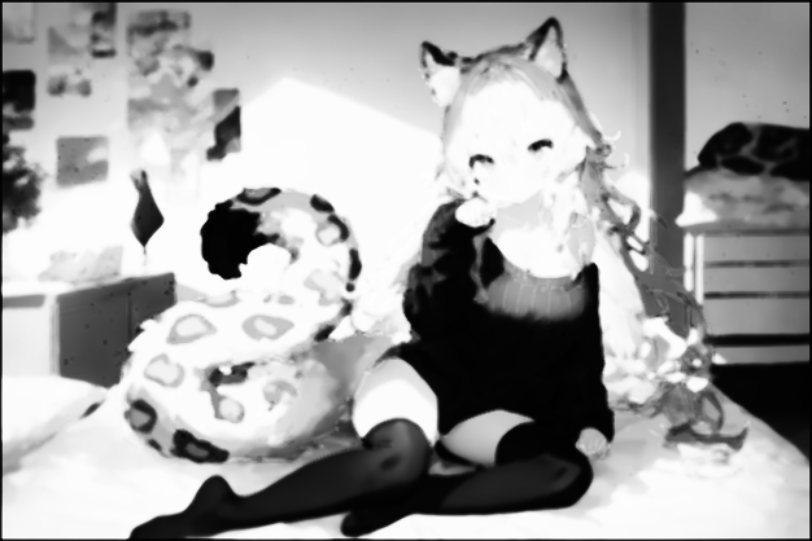

# Detail-Oriented Pixelization based on Contrast-Aware Outline Expansion.

A python implementation for this [project](https://github.com/KohakuBlueleaf/PixelOE-matlab).

- **No AI**
- **No NN**
- **GPU Free**

***Pure Pytorch implementation is WIP and can achieve over 180img/sec (bs1) on RTX4090 with 1920x1080 input and 480x270 output***

## Example

### Outline Expansion
|Original| Expanded|
|-|-|
|||

With this outline expansion method, you can obtain descent pixelization through some naive downsampling method:
|Expanded|Dowsampled|
|-|-|
|||

### Pixelization


#### Use outline expansion to improve existing method

Use the outline expansion method can improve lot of existing pixelization method.
Even the Neural Network based method can also be improved:

Here is the example of using outline expansion to improve "Make Your Own Sprites: Aliasing-Aware and Cell-Controllable Pixelization"(SIGGRAPH Asia 2022)


## Usage

You can install this package through `pip`:

```
pip install pixeloe
```

And then use cli to run the command:

```
pixeloe.pixelize --help
```

Which should give you this message:

```
usage: pixeloe.pixelize [-h] [--output_img OUTPUT_IMG] [--mode {center,contrast,k-centroid,bicubic,nearest}] [--target_size TARGET_SIZE]
                        [--patch_size PATCH_SIZE] [--thickness THICKNESS] [--no_color_matching] [--contrast CONTRAST]
                        [--saturation SATURATION] [--colors COLORS] [--no_upscale] [--no_downscale]
                        input_img

positional arguments:
  input_img

options:
  -h, --help            show this help message and exit
  --output_img OUTPUT_IMG, -O OUTPUT_IMG
  --mode {center,contrast,k-centroid,bicubic,nearest}, -M {center,contrast,k-centroid,bicubic,nearest}
  --target_size TARGET_SIZE, -S TARGET_SIZE
  --patch_size PATCH_SIZE, -P PATCH_SIZE
  --thickness THICKNESS, -T THICKNESS
  --no_color_matching
  --contrast CONTRAST
  --saturation SATURATION
  --colors COLORS
  --no_upscale
  --no_downscale
```

For example

```
pixeloe.pixelize img/test.png --output_img img/test2.png --target_size 256 --patch_size 8
```

### Commands list

* `pixeloe.pixelize`: Full Pixelization Process
  * Downscale mode list:
    * Nearest
    * Bicubic
    * Center: select the center pixel in the patch
    * Contrast: Contrast-based downscale method (see explantion below)
    * k-centroid: [k-centroid algorithm from Astropulse](https://github.com/Astropulse/pixeldetector/blob/6e88e18ddbd16529b5dd85b1c615cbb2e5778bf2/k-centroid.py#L19-L44)
* `pixeloe.outline`: Outline Expansion

---

Or you can import it into your code:

```python
import cv2
from pixeloe.pixelize import pixelize

img = cv2.imread("img/test.png")
img = pixelize(img, target_size=256, patch_size=8)
cv2.imwrite("img/test2.png", img)
```

## Algorithm Explanation

There are 2 main component of this algorithm:

1. Outline Expansion
2. Contrast-based downscale

### Outline Expansion

The goal of Outline Expansion is to expand important small details and high contrast edges in the image before downscaling, so that they are not lost in the final low resolution pixel art. The key steps are:

1. Compute a weight map that highlights areas to expand:

   - Convert image to grayscale
   - Calculate local median brightness in a neighborhood 2x(or 3x) the patch size
   - Find local max and min brightness within each patch
   - Compute bright and dark distances as the difference between local max/min and median
   - Combine two weighting terms:
     - weight_h1: Darker median pixels should prioritize keeping brighter details
     - weight_h2: Larger bright vs dark distance indicates which extreme details to keep
   - Apply sigmoid to the summed weights and normalize between 0-1
2. Erode the input image for a number of iterations to shrink bright regions
3. Dilate the input image for a number of iterations to expand bright regions
4. Blend the eroded and dilated images using the computed weight map:

   - Brighter weight values favor the dilated image to keep bright details
   - Darker weight values favor the eroded image to keep dark details
5. Apply morphological closing and opening to the blended result to clean up edge artifacts

The Contrast-Aware Outline Expansion ensures that fine details and sharp edges are broadened before the subsequent downscaling step. This allows them to be represented at the final low target resolution rather than being lost entirely. The selective erosion and dilation based on local contrast helps expand the right regions while preserving overall sharpness.

By integrating this outline expansion with an effective downscaling strategy and optional color palette optimization, the full pixelization pipeline is able to generate attractive pixel-style artwork from high resolution images. The intentional emphasis on important visual elements sets this approach apart from direct downsampling methods.

| Dilation | Erosion |
|-|-|
|||

| Blended| Weight|
|-|-|
|||

Darker pixel in the weight image means we take more dilated result and vice versa.

### Contrast-Based Downsampling

The Contrast-Based Downsampling step intelligently reduces the resolution of the outline-expanded image to the target pixel art size while preserving important visual details and contrast. The image is converted to the LAB color space to process luminance and color channels separately.

Luminance Channel Processing:

1. The `find_pixel` function is applied to the L (luminance) channel using a sliding window approach.
2. For each local window, `find_pixel` compares the center pixel to several local statistics:
   - `mid`: the center pixel value
   - `med`: the median pixel value
   - `mu`: the mean pixel value
   - `maxi`: the maximum pixel value
   - `mini`: the minimum pixel value
3. The function then makes an adaptive decision based on the local distribution of pixel values:
   - If `(med < mu) & (maxi - med > med - mini)`, the window has a skewed distribution towards lower values, suggesting a dark region or edge. In this case, the minimum value (`mini`) is selected to preserve the dark detail.
   - If `(med > mu) & (maxi - med < med - mini)`, the window has a skewed distribution towards higher values, indicating a bright region or edge. Here, the maximum value (`maxi`) is chosen to preserve the bright detail.
   - If neither condition is true, the center pixel value (`mid`) is kept to avoid introducing artifacts.
4. This adaptive selection process is applied to each local window across the entire luminance channel.

By intelligently choosing the most representative pixel value for each local window based on the local contrast and distribution, the `find_pixel` function ensures that important luminance details and edges are preserved during the downscaling process.

The color channels (A and B) are processed using a simple median filter to maintain color information while being robust to outliers and artifacts.

Finally, the processed LAB channels are combined and converted back to the RGB color space to obtain the downscaled pixel art image.

The Contrast-Based Downsampling approach, particularly its adaptive luminance processing, is a key reason why this pixelization algorithm achieves high-quality results. By making informed decisions based on local contrast, it preserves the most important visual information and maintains the artistic integrity of the pixel art style.

## Acknowledgement

* Astropulse
  * k-centorid downscaling algorithm.
* Claude 3 opus:
  * Summarize the algorithm.
  * Convert some matlab code to python.

## Citation

```bibtex
@misc{PixelOE,
    title={Detail-Oriented Pixelization based on Contrast-Aware Outline Expansion.}, 
    author={Shin-Ying Yeh},
    year={2024},
    month={March},
    howpublished=\url{https://github.com/KohakuBlueleaf/PixelOE},
}
```
