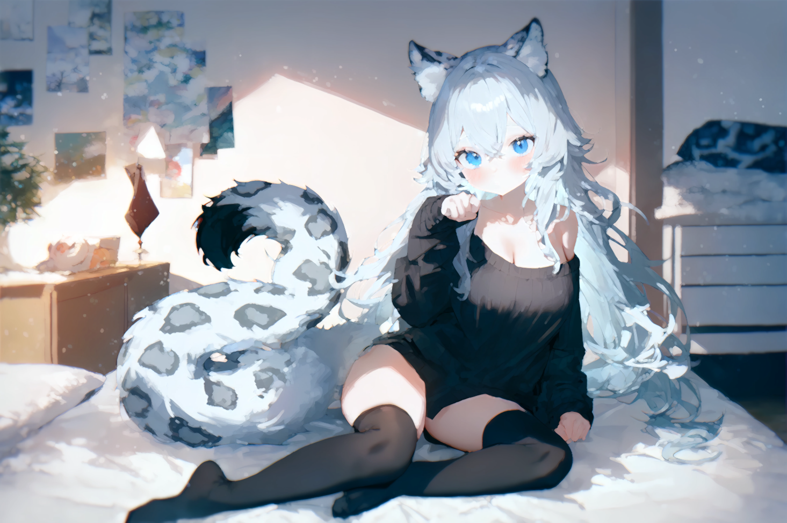

# PixelOE: Detail-Oriented ***Pixel***ization based on Contrast-Aware ***O***utline ***E***xpansion.
**Create stunning pixel art from high-resolution images without AI or complex networks.**

[](https://badge.fury.io/py/pixeloe) [](https://github.com/KohakuBlueleaf/PixelOE/blob/main/LICENSE)


PixelOE is a Python library that generates high-quality pixel art from standard images using a novel, **contrast-aware** approach. This method focuses on preserving crucial visual details by first **expanding outlines** of key features, then applying an intelligent downscaling to the target resolution.

**Key Features:**
*   **No AI/NN Required:**  Utilizes classical image processing methods for efficient and predictable results.
*   **Detail-Oriented:**  Emphasizes preservation of fine details and sharp edges.
*   **Contrast-Aware:**  Adapts downsampling based on local image contrast.
*   **Outline Expansion:**  Broadens important features before downscaling to prevent loss of detail.
*   **Flexible Downscale Modes:** Offers various downsampling methods for different styles (center, contrast, k-centroid, bicubic, nearest).
*   **Color Palette Optimization:** Option to quantize color palettes for a classic pixel art aesthetic.
*   **Fast Pure Pytorch implementation** Achieving over 180img/sec (bs1) on RTX4090 with 1920x1080 input and 480x270 output
*   **GPU Free**: All the core logic can be used without GPU.

## Example
### Outline Expansion
|Original| Expanded|
|-|-|
|||

With this outline expansion method, you can obtain descent pixelization through some naive downsampling method:
|Expanded|Dowsampled|
|-|-|
|||
### Pixelization


#### Use outline expansion to improve existing method

Use the outline expansion method can improve lot of existing pixelization method.
Even the Neural Network based method can also be improved:

Here is the example of using outline expansion to improve "Make Your Own Sprites: Aliasing-Aware and Cell-Controllable Pixelization"(SIGGRAPH Asia 2022)


## How It Works

The PixelOE algorithm has two key stages:

### 1. Contrast-Aware Outline Expansion:

This step is designed to make sure that fine details and high-contrast edges will survive after the downscaling step. Here is the process:

1.  **Weight Map Generation:**
    *   The input image is converted to grayscale.
    *   Local median brightness is calculated.
    *   Local max and min brightness values within each patch are found.
    *   "Bright" and "dark" distances are calculated using local max/min and median.
    *  Two weights are combined: 
        * The first weight is prioritize brighter details in darker median area
        * The second weight is based on the distance between the brighter/darker details.
    *   The combined weight is normalized to 0-1.

2.  **Selective Morphological Operations:**
    *   The input image is eroded to shrink bright regions
    *  The input image is dilated to expand bright regions
    *  The eroded and dilated results are blended together based on the generated weight map.
    * Morphological closing and opening are then applied to clean up edge artifacts.

| Dilation | Erosion |
|-|-|
|||

| Blended| Weight|
|-|-|
|||

### 2. Contrast-Based Downsampling:

This method reduces the image resolution while maintaining important luminance details.

1.  **LAB Color Space Conversion:** The image is converted to the LAB color space to process luminance (L) and color (A, B) channels separately.
2.  **Luminance Channel (L) Processing:**
    *   A sliding window with `find_pixel` function is used, and each patch is processed independently.
    *   Inside each patch, the center pixel is selected based on its relationship with the median, mean, min, max value within the patch.
    *   If a patch has skewed distribution on low value, the minimum value will be selected to keep the dark detail and vice versa.
    *   Otherwise, keep the center value.
3.  **Color Channel (A and B) Processing:** A simple median filter is applied to the A and B channels
4. **Convert back to RGB** The processed LAB channels are combined and converted back to the RGB color space.

By adaptively selecting the most representative pixel for each local area, the downscaling method preserves important luminance details and edges to maintain the artistic style in pixel art.

### Optional Enhancements

*   **Color Palette Optimization:** You can reduce the number of colors using k-means clustering or maxcover method for a more classic pixel art look.
*   **Color Matching:** Optionally transfer the color palette from the original image.


## Usage

### Installation

```bash
pip install pixeloe
```

### Command Line Interface (CLI)

The `pixeloe` package provides two primary commands:

*   `pixeloe.pixelize`: Full pixelization process
*   `pixeloe.outline`: Outline expansion

To view command usage, use the `--help` flag:

```bash
pixeloe.pixelize --help
```

```
usage: pixeloe.pixelize [-h] [--output_img OUTPUT_IMG] [--mode {center,contrast,k-centroid,bicubic,nearest}] [--target_size TARGET_SIZE]
                        [--patch_size PATCH_SIZE] [--thickness THICKNESS] [--no_color_matching] [--contrast CONTRAST]
                        [--saturation SATURATION] [--colors COLORS] [--no_upscale] [--no_downscale]
                        input_img

positional arguments:
  input_img

options:
  -h, --help            show this help message and exit
  --output_img OUTPUT_IMG, -O OUTPUT_IMG
  --mode {center,contrast,k-centroid,bicubic,nearest}, -M {center,contrast,k-centroid,bicubic,nearest}
  --target_size TARGET_SIZE, -S TARGET_SIZE
  --patch_size PATCH_SIZE, -P PATCH_SIZE
  --thickness THICKNESS, -T THICKNESS
  --no_color_matching
  --contrast CONTRAST
  --saturation SATURATION
  --colors COLORS
  --no_upscale
  --no_downscale
```

**Example:**

```bash
pixeloe.pixelize img/test.webp --output_img img/test2.webp --target_size 256 --patch_size 8
```

### Python API

You can integrate PixelOE directly into your Python projects:

```python
import cv2
from pixeloe.pixelize import pixelize

img = cv2.imread("img/test.webp")
img = pixelize(img, target_size=256, patch_size=8)
cv2.imwrite("img/test2.webp", img)
```

## Acknowledgement

*   Astropulse
    *   k-centroid downscaling algorithm.
*   Claude 3 opus:
    *   Convert some matlab code to python.
*   Gemini 2.0 Flash
    *   Refine this README

## Citation
```bibtex
@misc{PixelOE,
    title={Detail-Oriented Pixelization based on Contrast-Aware Outline Expansion.}, 
    author={Shin-Ying Yeh},
    year={2024},
    month={March},
    howpublished=\url{https://github.com/KohakuBlueleaf/PixelOE},
}
```
