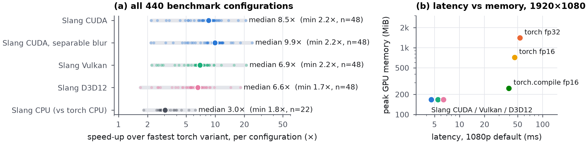
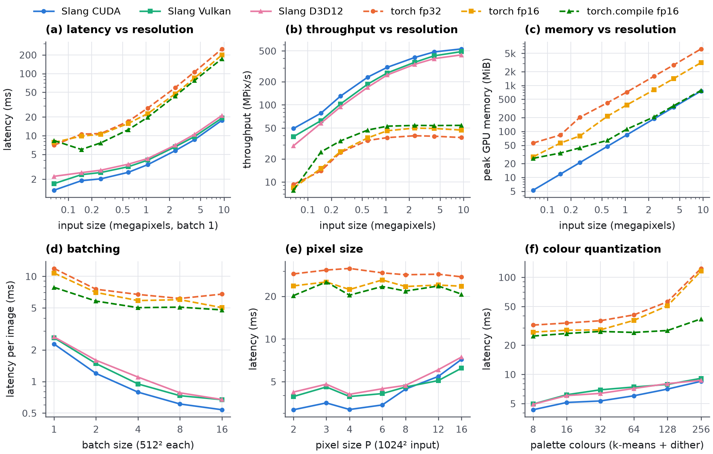
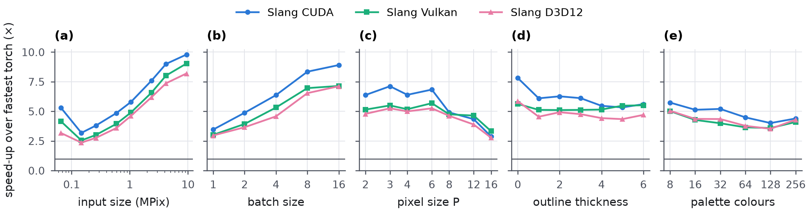
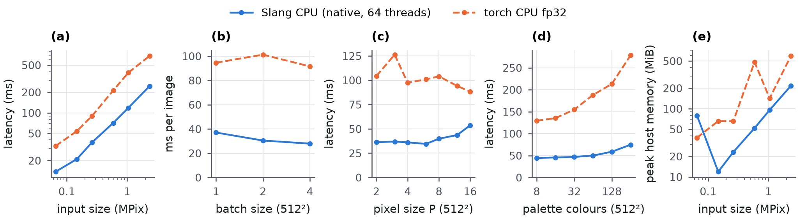
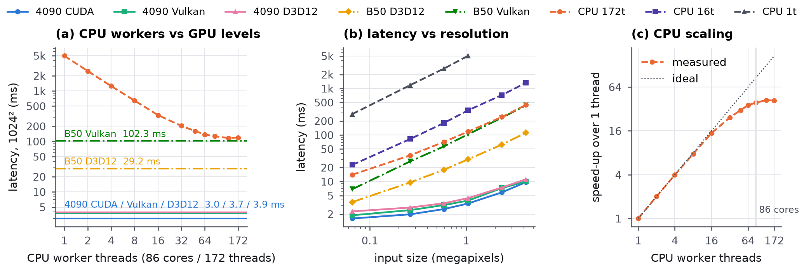

# Slang vs torch benchmarks

Benchmarks for `pixeloe.slang` (the Slang compute-kernel port of the pixelize
pipeline) against every torch variant of `pixeloe.torch`. Raw results go to
`outputs/bench/…` (git-ignored); the figures here are rendered from them.

| folder | contents |
|---|---|
| `matrix/` | full matrix: 5 sizes × 18 settings × 11 implementation paths (`run_all.py` → `worker.py` per path, `analyze.py` → `summary.md`) |
| `sweeps/` | scaling sweeps: resolution, batch, pixel size, thickness, palette (`sweep.py`); Slang-only device comparison, CPU workers vs RTX 4090 vs Arc Pro B50 (`devices.py`) |
| `figures/` | paper-style PNGs (`make_figures.py`) and the interactive `overview.html` |
| `examples/` | image exports: torch vs Slang comparison sheets, 2×2 grids, lattice vs sliding statistics, k-centroid tie analysis |
| `tools/` | `isa_report.py`: SIMD width of the Slang-built CPU kernels (dumpbin) |
| `common/` | process / device memory probes |

Every implementation path (and every device in `devices.py`) runs in its own
subprocess so allocator state and co-resident devices cannot affect another
path's numbers.

```
python benchmarks/slang_vs_torch/matrix/run_all.py      # ~1.5 h (torch.compile paths recompile per shape)
python benchmarks/slang_vs_torch/sweeps/sweep.py        # ~30 min
python benchmarks/slang_vs_torch/sweeps/devices.py      # ~10 min
python benchmarks/slang_vs_torch/figures/make_figures.py
```

## Figures

`fig_overview.png` - speed-up over the fastest torch variant for all 440
configurations, and latency vs peak memory at 1920×1080.



`fig_gpu_scaling.png` - latency, throughput and memory vs resolution; batching;
pixel size; palette size.



`fig_gpu_speedup.png` - Slang speed-up along every sweep.



`fig_cpu.png` - native Slang CPU backend vs torch on CPU.



`fig_devices.png` - Slang only: CPU worker count vs RTX 4090 vs Arc Pro B50.



Machine: RTX 4090, 2× Intel Arc Pro B50, 86-core / 172-thread Intel CPU,
Windows 11, torch 2.9.1 + CUDA 13.0, slangpy 0.43.1.
